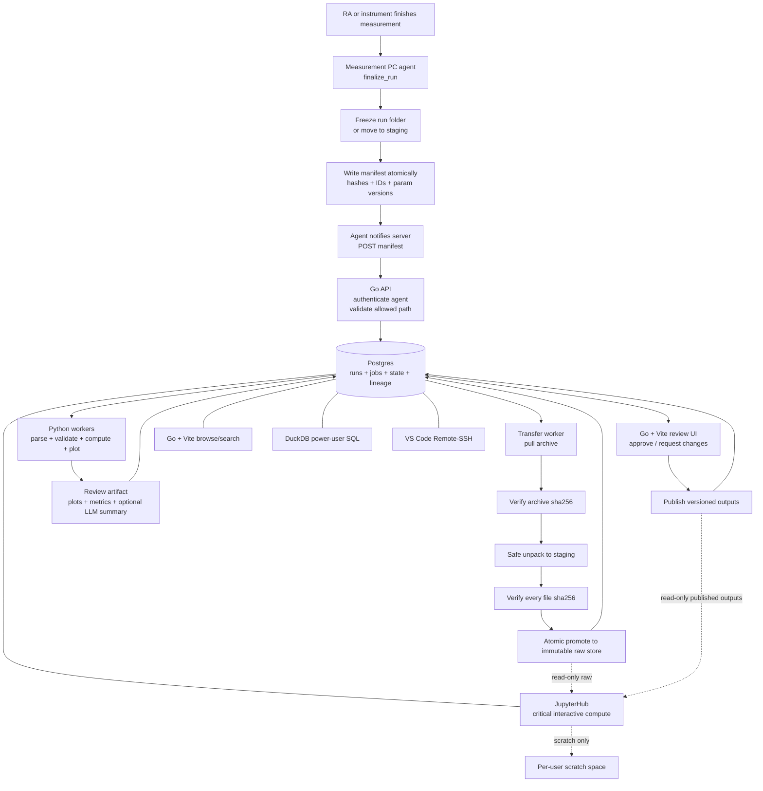

# Lab Data Management System — Updated Implementation Architecture

**Domain:** materials science / nanoelectronics: FETs, capacitors, resistive switches, spin valves, AFM, and ellipsometry.  
**Scale:** approximately 30-person lab, approximately 10 initial users, GB-scale data, one lab Linux server, one maintainer.  
**Hard requirement:** any published result must be reconstructable from recorded inputs.

This version keeps the original architecture's core direction but incorporates the implementation review changes: manifest-declared completion as the only ingest trigger, a durable Postgres-backed job queue, stricter reproducibility records, safer archive handling, versioned review-time corrections, earlier backups, and JupyterHub as a first-class critical component.

---

## 1. Non-negotiable design principles

These principles should govern future tradeoffs.

- **Producer happy path must be no harder than today.** RAs should continue producing normal measurement folders. The system should adapt around the folder workflow, not force operators to learn a new ritual.
- **Manifest-declared completion is the only ingest trigger.** The system never treats “a file appeared” or “a folder changed” as proof that a run is complete.
- **Two doors, one hallway.** A run may be completed by the instrument or by an operator action, but both paths must converge immediately into the same `finalize_run` routine and the same manifest contract.
- **Heuristic-as-suggestion, never heuristic-as-truth.** Names and paths may propose metadata, but structural truth is stored as explicit database relationships.
- **Structural truth lives in Postgres, is editable, and is versioned.** The manifest records IDs and parameter-version IDs, not copied structural values.
- **Freeze at declaration.** The file set hashed at completion is exactly the file set transferred, stored, parsed, and reviewed.
- **Files first, DB last.** Raw bytes are durably placed and verified before the database records the run as promoted.
- **Events for latency, reconciliation for correctness.** Agent notifications give low latency; periodic scans guarantee missed notifications do not lose runs.
- **Idempotency everywhere.** Every operation is keyed by `run_id`, manifest hash, archive hash, or job idempotency key so retries are safe.
- **The LLM is advisory.** It may summarize and flag anomalies, but it never mutates data, auto-approves, or gates publication.
- **JupyterHub is critical but not authoritative.** JupyterHub is a first-class v1 exploration interface, but notebooks must not be the source of production state transitions.

---

## 2. Architecture at a glance



The Markdown architecture, not the older Mermaid diagram, should be treated as the source of truth. In v1 there is no folder watcher, no Streamlit review app, no Metabase requirement, and no Prefect requirement.

---

## 3. Stack and component responsibilities

Reuse the existing **Go + Postgres + Vite** application. Keep scientific processing in **Python**. Keep **JupyterHub** as a critical first-class interface for interactive server-side analysis.

| Layer | Tech | Owns |
|---|---|---|
| Web + API | Go + Vite | catalog, auth, review UI, browse/search UI, agent trigger endpoints, state-transition API |
| Catalog / state | Postgres | source of truth for runs, metadata, parameter versions, jobs, state transitions, lineage, artifacts |
| Durable queue | Postgres `jobs` table | orchestration, retries, locking, failure records, idempotency |
| Processing workers | Python | parsing, validation, fitting, plotting, AFM module, ellipsometry parsing, optional LLM call |
| Interactive compute | JupyterHub | critical server-side notebooks, teaching notebooks, exploratory analysis, shared examples |
| Remote development | VS Code Remote-SSH | maintainer and power-user development on the lab server |
| Ad-hoc SQL | DuckDB library | SQL over CSVs, Parquet exports, and selected derived tables |
| Edge | nginx on VPS | public entry for human-facing web ports only |
| Measurement agents | Python or Go agent on measurement PCs | finalize, freeze, hash, manifest, pack, list ready runs |

The Go side and Python side meet through Postgres, but with one important constraint: **workers should not freely mutate run state**. Prefer explicit transition functions or API-mediated transitions.

Recommended boundary:

- Go/API owns allowed state transitions and review actions.
- Python workers own scientific outputs and job results.
- Postgres enforces transition legality, idempotency, and audit history.
- JupyterHub has read-only catalog/data access by default and writable access only to user scratch/project areas.

---

## 4. Network and trust boundaries

- Measurement PCs communicate with the lab server over LAN or VPN.
- Measurement PCs do **not** expose data through the public VPS proxy.
- The nginx VPS fronts only human-facing web routes.
- Server-to-agent transfer should use authenticated LAN/VPN access.
- Agent notification can use shared-key authentication for v1, but mTLS is the preferred endpoint once multiple agents exist.
- Each agent has an explicit allowed root path. A manifest-provided `meas_path` is valid only if it resolves under that agent's configured root.

The server must treat the agent as authenticated but not infallible. A buggy or compromised agent must not be able to make the server read or write arbitrary paths.

---

## 5. Storage and reproducibility model

Raw data remains as files on disk. Postgres is the catalog and state machine.

Raw data is:

- immutable,
- write-once,
- content-address-verified,
- promoted only after hash verification,
- readable by users and JupyterHub,
- writable only by the ingest service account.

Processed and published outputs are append-only versions. Never overwrite a published result. A `latest` pointer is allowed, but the underlying versioned artifact must remain immutable.

Recommended layout:

```text
/srv/labdata/
  raw/
    <sample_id>/<device_id>/<run_id>/...
  processed/
    <run_id>/analysis_version_001/...
    <run_id>/analysis_version_002/...
  published/
    <publication_version_id>/...
  manifests/
    <run_id>/manifest.json
  scratch/
    <username>/...
  notebooks/
    shared/
    teaching/
    examples/
```

The raw and published trees should be read-only to normal users and JupyterHub users. Per-user scratch is writable.

### Reproducibility receipt

For each published result, record a compact reproducibility receipt:

```text
published_result_id
run_id
manifest_hash
raw_file_hashes
parameter_version_ids
processing_git_sha
processing_dirty_tree_flag
processing_environment_id
processing_command
parser_version
instrument_software_version, if available
random_seed, if relevant
output_artifact_hashes
review_decision_id
published_by
published_at
```

The original design recorded raw file hashes, Git SHA, parameter versions, and LLM model/prompt version. Keep those, but add the processing environment and output artifact hashes. A Git SHA alone does not fully define a Python scientific environment.

### Processing environment records

Create a `processing_environments` table or equivalent artifact with:

```text
id
created_at
python_version
os_image_or_container_digest
conda_lock_hash or pip_freeze_hash
critical_package_versions_json
docker_image_digest, if containerized
entrypoint_command
notes
```

For v1, a `conda-lock` file or pinned virtualenv export may be enough. A container image digest is better if the lab is comfortable running workers in containers.

---

## 6. Backup and restore requirements

Backups are not a late hardening item. They are part of v1 because reproducibility is a hard requirement.

Minimum production requirement:

- 3 copies of important data,
- 2 different storage media or systems,
- 1 offsite or physically separate copy,
- periodic restore test,
- immutable raw data protected from normal user writes,
- measurement-PC retention until server copy is verified and backed up.

A backup is not considered real until a restore has been tested.

Suggested policy:

- Keep measurement-PC copy until the server marks the run `backed_up` or until a retention threshold approved by the lab.
- Snapshot `/srv/labdata/raw` and `/srv/labdata/published`.
- Back up Postgres with point-in-time recovery if possible.
- Back up manifests and reproducibility receipts with raw data.
- Test restoring one full run from raw files + database metadata + processing environment.

---

## 7. Domain data model

Structural metadata and per-run instrument metadata have different lifetimes and cardinalities. Do not flatten them into one table.

```text
sample  ──<  device  ──<  contact_config  ──<  run  ──  instrument_json_raw
```

### sample

A sample represents the physical/material stack identity, for example `9D66P1` or `9D66P1_m50V_UV`.

Owns:

- sample code,
- material stack,
- dielectric / oxide properties,
- fabrication batch,
- structural parameters shared across devices,
- sample-level parameter versions.

### device

A device is the physical measured part, for example `gr_mob_31_f1`.

Owns:

- device name,
- device class: FET, MIM/MIOS capacitor, resistive switch, spin valve, AFM sample area, ellipsometry sample region, etc.,
- sample relationship,
- fabrication identity,
- device-level notes and lifecycle state.

A device is typed. Per-class schemas should validate required fields.

### contact_config

A contact configuration defines the terminal pairing and active geometry.

For multi-terminal FETs, choosing `sd_b1b2` versus `b1d_t1b2` changes which terminals source/sense current and voltage. That changes active L and sometimes W. Therefore **L/W belong on `contact_config`, not on `device` and not on `run`**.

For two-terminal devices, this layer collapses to one trivial default contact configuration and can be hidden from the UI.

### run

A run represents one declared measurement event.

Owns:

- run ID,
- manifest hash,
- agent ID,
- measurement type,
- contact_config reference if known,
- declared source,
- condition labels,
- operator comment,
- run state,
- links to raw files, parser outputs, review artifacts, and published artifacts.

### instrument JSON

Instrument JSON is per-run, machine-generated, immutable, hashed, and transferred with the raw data. Do not manually remodel it into operator-entered columns. If cross-run querying is needed, build a derived parser index.

---

## 8. Treatments and condition labels

Freeform condition labels are convenient but will fragment quickly. Use a controlled vocabulary plus free text from the beginning.

Recommended v1 compromise:

```text
condition_label
  id
  canonical_name       -- pristine, after_uv, after_anneal, post_plasma, etc.
  aliases_json         -- after UV, UV exposed, post-uv, etc.
  description
```

Runs may still carry labels, but labels should resolve to canonical IDs.

Add a minimal treatment-event table early if UV, annealing, plasma exposure, storage environment, or similar interventions are scientifically important:

```text
treatment_event
  id
  device_id
  treatment_type
  started_at
  ended_at
  parameters_json
  performed_by
  notes
```

Treatments are events on the device, not new devices, unless the treatment physically creates a new structure that should no longer share the previous parameter lineage. If a treatment changes a structural parameter, create a new parameter version.

---

## 9. Parameter versioning

Parameter versions attach at the level where the parameter actually lives.

Examples:

- sample stack version: oxide thickness, dielectric, stack composition,
- contact geometry version: L, W, terminal roles,
- processing parameter version: fit windows, threshold definitions, smoothing choices,
- calibration version: instrument calibration constants.

The manifest pins parameter versions known at measurement declaration time. Review-time scientific corrections create new versions and cause reprocessing; they do not overwrite the old version.

Distinguish two kinds of review edits:

### Identity/display metadata correction

Examples:

- typo in operator comment,
- alias cleanup,
- display label,
- notes.

These may be simple audited edits.

### Scientific parameter correction

Examples:

- oxide thickness correction,
- L/W correction,
- wrong contact configuration,
- changed fit window,
- calibration correction.

These must create a new parameter version and a new processing or publishing version. Previous results may be marked superseded, but they must remain reconstructable.

---

## 10. Registration and metadata discovery

Use names and paths to propose metadata, not to define it.

Example:

- Device name begins with `9D66P1`.
- System proposes: “This appears to belong to sample `9D66P1`. Inherit stack version 3?”
- Operator confirms.
- The stored truth is the database foreign key, not the parsed substring.

Registration happens at two levels:

1. device registration: device class, sample relationship, fabrication identity,
2. contact_config registration: terminal roles, active L/W, contact geometry version.

### Do not block raw ingest on perfect metadata

A run should be ingestible even if device/contact metadata is incomplete. Processing and publication can be blocked, but raw capture should not be.

Add a holding state:

```text
needs_metadata
```

This allows:

```text
promoted → needs_metadata → parsing
```

Use this when raw files are safely stored but the run cannot yet be scientifically interpreted.

---

## 11. Manifest contract

The manifest is the universal precondition for transfer and the metadata contract. It carries identity and provenance. It should not copy structural values such as oxide thickness or L/W; it should reference IDs and parameter versions.

```jsonc
{
  "run_id": "uuid-or-snowflake",
  "schema_version": 1,
  "completion_source": "instrument | operator",
  "declared_by": "operator-or-software-id",
  "declared_at": "2026-06-11T09:41:00Z",

  "agent_id": "measpc-probestation-01",
  "meas_path": "/data/runs/9D66P1/2026-06-11/gr_mob_31_f1/...",

  "sample_id": "9D66P1",
  "device_id": "gr_mob_31_f1",
  "contact_config_id": "gr_mob_31_f1__sd_b1b2",
  "param_versions": {
    "sample_stack": 3,
    "contact_geometry": 2
  },

  "measurement_type": "fet_transfer_4probe",
  "condition_labels": ["after_uv"],
  "operator_comment": "optional free text",

  "instrument_json": "params_run.json",

  "files": [
    {
      "name": "iv_sweep.data",
      "bytes": 18234,
      "sha256": "..."
    },
    {
      "name": "params_run.json",
      "bytes": 4096,
      "sha256": "..."
    }
  ],

  "archive": {
    "name": "run.tar.zst",
    "sha256": "..."
  }
}
```

The manifest is written last and atomically on the measurement PC. Use a temporary filename and atomic rename, for example:

```text
manifest.json.tmp → fsync → rename to manifest.json
```

The server should not ingest a half-written manifest.

---

## 12. Completion and trigger design

Completion is declared by manifest creation. There are two declaration paths.

### Machine path

The measurement software finishes writing, flushes/closes files, calls or embeds `finalize_run`, and writes `manifest.json` atomically.

### Operator path

The operator clicks “finished” in the web app. The server asks the measurement-PC agent to finalize that run folder. The agent enumerates files, checks for live writes, hashes the file set, freezes it, and writes an operator-tagged manifest.

The operator does not bypass the manifest. The click commissions a manifest.

### Mid-measurement guard

Only the agent can reliably inspect the live folder. Before generating a manifest, the agent should check:

- moving mtimes,
- open write handles using `lsof` or `/proc`,
- file sizes changing across a short interval,
- known instrument lock/temp files if applicable.

Machine path may wait. Operator path should refuse or warn, depending on policy.

### Freeze at declaration

At manifest time, the agent must ensure the hashed file set cannot change before transfer. Options:

- move the run to a per-run staging directory,
- mark the run read-only,
- or copy into an agent-owned frozen staging area.

The frozen set, not the live measurement folder, is what gets packed and transferred.

---

## 13. Transfer — agent-notify pull

Discovery is agent-to-server notification. Data movement is server pull from the agent.

### Pull flow

1. Agent POSTs manifest to the server.
2. Server authenticates the agent.
3. Server validates `meas_path` against the configured allowed root for that agent.
4. Server inserts or updates the run/job idempotently.
5. Transfer worker asks the agent for a packed archive.
6. Agent creates tar archive, optionally zstd-compressed.
7. Server verifies archive `sha256`.
8. Server safely unpacks into per-run staging.
9. Server verifies every file listed in the manifest by size and `sha256`.
10. Server rejects unexpected files unless explicitly allowed by manifest/schema policy.
11. Server atomically promotes verified files to canonical raw storage.
12. Server updates Postgres to `promoted` in a transaction.

### Two hash layers

- Archive hash catches transit corruption early.
- Per-file hashes are authoritative for final stored raw data.

### Safe archive unpacking

The unpacker must reject:

- absolute paths,
- `..` path traversal,
- symlinks,
- hardlinks,
- device files,
- FIFOs,
- unexpected file ownership or modes,
- duplicate normalized paths,
- files not listed in the manifest,
- paths that escape the run root after normalization.

Never unpack a tar directly into the canonical raw store. Always unpack to staging, validate, then promote.

### Retention

Keep the measurement-PC copy until server verification and backup have succeeded. Prefer `mark-pulled` or `mark-backed-up` retention over hard delete.

### Reconciliation

Agent notification can be missed. A periodic reconciliation scan should ask each agent for ready/frozen runs and re-drive any run stuck in `declared`, `pulling`, or `transfer_failed` past a timeout.

---

## 14. State machine

Transfer gates pipeline entry. Failure states must distinguish transfer failure from scientific validation failure.

```text
declared
  → pulling
    → unpacked
      → verified
        → promoted
          → needs_metadata        optional holding state
          → parsing
            → validated
              → processing
                → awaiting_review
                  → approved
                    → publishing
                      → published
                  → changes_requested
                    → processing or awaiting_review

Failure / holding states:
  transfer_failed
  manifest_mismatch
  unsafe_archive
  needs_metadata
  parser_failed
  quarantined
  processing_failed
  review_rejected
```

If an instrument manifest later disagrees with an operator snapshot, the instrument manifest is authoritative for the file set, but the discrepancy must be flagged and audited rather than silently overwritten.

---

## 15. Postgres jobs table as durable queue

For v1, the `jobs` table is the orchestrator. `LISTEN/NOTIFY` may wake workers, but it is not the queue. Polling must still work if a notification is missed.

Recommended fields:

```text
jobs
  id
  job_type
  run_id
  state                  -- queued, running, succeeded, failed, dead
  priority
  attempt_count
  max_attempts
  available_at
  locked_by
  locked_until
  idempotency_key
  payload_json
  result_json
  last_error
  created_at
  started_at
  finished_at
```

Workers should claim jobs with row locking, for example:

```sql
SELECT *
FROM jobs
WHERE state = 'queued'
  AND available_at <= now()
ORDER BY priority DESC, created_at ASC
FOR UPDATE SKIP LOCKED
LIMIT 1;
```

A worker that crashes leaves a stale `locked_until`; another worker can reclaim the job later.

Recommended job types:

```text
pull_run
verify_run
promote_run
parse_run
validate_run
process_run
create_review_artifact
send_notification
publish_run
reconcile_agent
backup_check
```

Some of these may be combined in v1, but the job model should not prevent splitting them later.

---

## 16. State transitions and audit trail

Do not let arbitrary code set `runs.state` directly.

Prefer one of these patterns:

1. Go API owns all transitions, and workers report job success/failure.
2. Postgres stored function owns transition validation.
3. Hybrid: worker calls a narrow transition function with expected source and target states.

Recommended transition call shape:

```text
transition_run(
  run_id,
  expected_from_state,
  target_state,
  actor_type,
  actor_id,
  reason,
  payload_json
)
```

Record every transition:

```text
run_state_transitions
  id
  run_id
  from_state
  to_state
  actor_type
  actor_id
  reason
  payload_json
  created_at
```

This prevents accidental illegal transitions and gives a clean audit trail for publication.

---

## 17. Pipelines and review gate

There are two event-triggered pipelines, but the “pause” is a durable database state, not a held process.

### Pipeline A — automatic after promotion

```text
promoted or needs_metadata resolved
  → parse
  → parser validation
  → compute results
  → generate plots
  → optional LLM review summary
  → write review artifact
  → awaiting_review
  → notify reviewer
```

Parser validation should include:

- expected column count,
- header-declared versus actual row count,
- format terminator/footer presence where applicable,
- no all-NaN trailing rows,
- manifest hash checks,
- instrument JSON presence and validity,
- measurement-type-specific sanity checks.

Validation failure sets `quarantined` or `parser_failed`; it must not crash the worker or publish partial outputs.

### Human review

The reviewer opens a Go + Vite review page showing:

- raw metadata,
- proposed/confirmed sample-device-contact hierarchy,
- plots,
- computed metrics,
- parser warnings,
- anomaly flags,
- optional LLM summary,
- parameter versions used,
- reproducibility receipt preview.

Actions:

- approve,
- request changes,
- correct identity metadata,
- create scientific parameter correction,
- send to quarantine,
- mark superseded if appropriate.

### Pipeline B — on approval

```text
approved
  → reprocess if parameter versions changed
  → publish append-only output version
  → hash output artifacts
  → write reproducibility receipt
  → published
  → notify
```

Published outputs go beside raw data only as versioned outputs or links. Never overwrite raw data.

---

## 18. JupyterHub — critical interactive compute layer

JupyterHub is a critical part of the project and should be included in v1. It provides server-side exploration, training notebooks, lightweight collaborative analysis, and a bridge between automated processing and human scientific interpretation.

However, it should be designed so that exploration cannot corrupt production truth.

### JupyterHub responsibilities

JupyterHub owns:

- exploratory notebooks,
- teaching notebooks for lab members,
- examples for querying the catalog,
- reproducibility demonstrations,
- ad-hoc analysis against read-only raw and published data,
- prototyping new parsers before they are promoted into versioned pipeline code,
- DuckDB-powered local analysis over selected exported files.

JupyterHub does **not** own:

- raw ingest,
- run state transitions,
- approval decisions,
- publication state,
- canonical parameter edits,
- mutation of immutable raw data.

### Access model

Recommended default:

```text
JupyterHub users:
  read-only: /srv/labdata/raw
  read-only: /srv/labdata/published
  read-only or controlled: /srv/labdata/processed
  writable: /srv/labdata/scratch/<username>
  writable: /srv/labdata/notebooks/<project> if project permissions allow
```

Postgres access should use a read-only role by default:

```text
labdata_readonly
  SELECT on catalog views
  SELECT on published result views
  no UPDATE/DELETE/INSERT on production tables
```

A separate maintainer role may exist for development, but routine notebook work should not use it.

### Notebook-to-pipeline promotion rule

A notebook can be a prototype, explanation, or review aid. Production pipeline steps should be plain versioned Python modules. If a notebook must become a formal report, run it through a controlled tool such as Papermill and record the notebook version, parameters, environment, and output hashes.

Promotion path:

```text
exploratory notebook
  → reviewed Python module or parametrized report
  → tests on known runs
  → pinned environment
  → pipeline job type
  → recorded in processing_environment + reproducibility receipt
```

### JupyterHub operational requirements

For v1:

- authenticate users through the same lab identity mechanism where possible,
- run notebooks on the lab server, not user laptops,
- restrict memory/CPU per user if needed,
- provide a shared Python environment matching or compatible with processing workers,
- include `labdata` helper library for catalog queries,
- include DuckDB and common scientific packages,
- make raw data read-only,
- back up important shared notebooks, but not necessarily every user scratch file.

JupyterHub is critical for adoption, but it must remain adjacent to the production pipeline rather than becoming the production pipeline.

---

## 19. Browse, search, and DuckDB

The Go + Vite app should provide the common browse/search path:

- operator,
- sample,
- device,
- contact config,
- date range,
- measurement type,
- condition label,
- state,
- publication status.

DuckDB should serve power users who want SQL over CSVs, Parquet exports, or derived tables.

Metabase or another BI layer should remain deferred unless non-technical users repeatedly need complex self-serve dashboards that the Vite app cannot cover.

---

## 20. LLM review

The LLM is optional and advisory.

Allowed uses:

- summarize run quality,
- compare this run to last N similar runs,
- flag anomalies,
- produce a human-readable review note,
- suggest questions for the reviewer.

Disallowed uses:

- auto-approval,
- direct metadata mutation,
- direct parameter mutation,
- publication gating without human review,
- replacing parser validation.

Record:

```text
llm_records
  id
  run_id
  model
  provider
  prompt_version
  input_policy
  input_hash
  output_hash
  created_at
```

### Privacy decision

Raw nanoelectronics data may be sensitive. Before using a third-party inference API, get PI approval or constrain input to derived summaries only. If data cannot leave the building, self-hosting an open model is the one scenario that may justify adding a GPU.

The LLM step should be added after the ingest-review-publish loop works.

---

## 21. Notifications

Notifications are side effects of state transitions, never the source of truth.

Initial channels:

- email,
- Telegram bot.

Notification events:

- run awaiting review,
- run quarantined for too long,
- transfer failed after retry threshold,
- publication complete,
- backup/check failure,
- agent offline or reconciliation found stuck runs.

Tokenized links are acceptable for review convenience, but tokens should be scoped, expiring, and auditable.

---

## 22. Security and permissions

Minimum controls:

- authenticate agents,
- validate agent paths,
- safe archive unpacking,
- immutable raw store permissions,
- read-only JupyterHub access to raw/published data,
- separate service accounts for ingest, workers, web app, and notebooks,
- audit state transitions,
- audit review decisions,
- do not expose measurement PCs through public proxy,
- rate-limit or queue transfers,
- protect tokenized approval links.

Recommended Unix ownership model:

```text
raw files:
  owner: labdata-ingest
  group: labdata-readers
  mode: read-only after promotion

processed/published:
  owner: labdata-worker
  group: labdata-readers
  append-only by service account

scratch:
  owner: individual user
  mode: user-writable
```

---

## 23. Suggested database spine

This is not a full schema, but it is the minimum conceptual spine.

```text
samples
devices
contact_configs
sample_parameter_versions
contact_geometry_versions
processing_parameter_versions
calibration_versions
runs
run_files
manifests
instrument_metadata_raw
condition_labels
run_condition_labels
treatment_events
jobs
run_state_transitions
parser_results
analysis_artifacts
review_artifacts
review_decisions
published_results
published_artifacts
processing_environments
llm_records
notifications
agents
agent_allowed_roots
backup_records
```

Use views for notebook and browse access rather than exposing every internal table directly.

---

## 24. Revised build order for a solo maintainer

This order keeps the system implementable while preserving JupyterHub as a critical v1 component.

1. **Storage, permissions, and backup baseline**
   - Create raw/processed/published/scratch layout.
   - Enforce read-only raw permissions.
   - Set up initial backup and perform one restore test.

2. **Postgres schema spine**
   - Samples, devices, contact configs, runs, run files, manifests, parameter versions, jobs, state transitions, agents, artifacts.

3. **JupyterHub foundation**
   - Deploy JupyterHub on the lab server.
   - Give users read-only access to raw/published data and writable scratch.
   - Provide read-only Postgres views and DuckDB examples.
   - Add starter notebooks for browsing and plotting existing/sample data.

4. **Manifest contract and one measurement-PC agent**
   - Implement `finalize_run`, freeze, hash, atomic manifest write, pack.
   - Start with the machine path only.

5. **Server manifest endpoint and durable jobs table**
   - Authenticate agent.
   - Validate allowed path.
   - Insert idempotent run/job records.

6. **Transfer, verify, and promote**
   - Pull archive.
   - Verify archive hash.
   - Safely unpack.
   - Verify per-file hashes.
   - Promote files.
   - Transition to `promoted` or failure state.

7. **Pipeline A for one measurement type**
   - Start with FET transfer or the highest-value existing parser.
   - Parse, validate, compute, plot, write review artifact.
   - No LLM yet.

8. **Go + Vite review UI**
   - Review artifact page.
   - Approve / request changes.
   - Metadata correction and parameter-version correction.
   - State-transition audit.

9. **Pipeline B and publishing**
   - Reprocess if needed.
   - Publish append-only outputs.
   - Hash published artifacts.
   - Write reproducibility receipt.

10. **Operator completion path**
    - Web app “finished” action calls the agent to commission a manifest.
    - Include mid-measurement guard behavior.

11. **Reconciliation and operational hardening**
    - Periodic agent scan.
    - Stuck job recovery.
    - Transfer concurrency caps.
    - Agent offline alerts.
    - Backup status checks.

12. **Additional device types and parsers**
    - AFM, ellipsometry, capacitors, resistive switches, spin valves.
    - Add per-device-class schemas.

13. **LLM review**
    - Add only after PI/privacy decision.
    - Prefer derived summaries if sending to a third-party API.

14. **Optional future services**
    - Prefect only if the jobs table becomes operationally insufficient.
    - Metabase only if the Vite browse UI and JupyterHub/DuckDB do not satisfy exploration needs.

---

## 25. V1 acceptance criteria

A v1 implementation is viable when the following are true:

- A run can be finalized on one measurement PC by manifest declaration.
- The server can pull, verify, stage, and promote the run without manual copying.
- Raw files are immutable after promotion.
- Raw files and Postgres metadata are backed up, and restore has been tested.
- A Python worker can parse and process at least one measurement type.
- A reviewer can approve or request changes in the Go + Vite app.
- A scientific parameter correction creates a new version and reprocessing record.
- Published outputs are append-only and hashed.
- A reproducibility receipt exists for each published result.
- JupyterHub users can explore raw/published data read-only and write only to scratch/project notebook areas.
- A missed notification can be recovered by reconciliation.
- Duplicate notifications or retries do not create duplicate runs or artifacts.

---

## 26. Open decisions

- **Agent language:** Python may be fastest because the scientific stack is already Python; Go may be simpler for static deployment. Either is acceptable if the manifest contract is stable.
- **Agent authentication:** shared key for first controlled PC; mTLS preferred once multiple agents exist.
- **Processing environment:** conda-lock/venv export for v1, container digest if practical.
- **Treatment model:** controlled labels immediately; full treatment-event workflow if UV/anneal/plasma history becomes central.
- **LLM privacy:** PI sign-off, derived-only summaries, or self-hosting.
- **Prefect:** deferred until the Postgres jobs table lacks needed observability/retry ergonomics.
- **Metabase:** deferred unless broad self-serve dashboarding becomes a real recurring need.

---

## 27. Final recommended architecture position

Proceed with the architecture, with these firm implementation decisions:

1. Manifest-declared completion is the only ingest trigger.
2. The server pulls from authenticated agents; measurement PCs are not publicly exposed.
3. Raw files are immutable, verified, backed up, and promoted before database state says they exist.
4. Postgres is the durable state machine and job queue; `LISTEN/NOTIFY` is only a wake-up optimization.
5. Parameter versions and processing environments are part of reproducibility, not optional metadata.
6. Review-time scientific corrections create new versions and new processing records.
7. JupyterHub is a critical v1 interface for exploration, but not a production state mutator.
8. LLM review is advisory and deferred until privacy is resolved.
9. Prefect, Metabase, and other heavier services remain optional future additions.

This produces a system that is realistic for one maintainer, usable by RAs, useful to power users through JupyterHub, and strong enough to support reconstructable published results.
